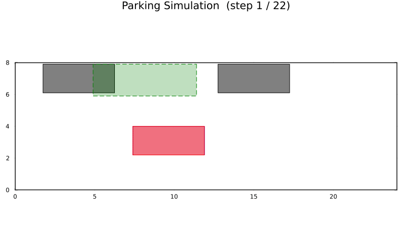

# Parallel parking

Parallel parking on a tight street. The example builds a roadside spot between two
already-parked cars and a curb using `parallel_parking`, then plans a park-in
with [`plan_park`](@ref).

Full source:

```julia
# Parallel-parking example
# Plans a parallel-parking path into a roadside spot and animates the result.

using Parking
using Plots

# 1. Build the scenario
env, vehicle = parallel_parking()

# 2. Set the start pose on the lane, in front of the spot
start = Pose(4.0, 1.6, 0.0)

# 3. Plan
res = plan_park(vehicle, env, start; clearance = 0.15)
println("Status: ", res.status)
println("Path length: ", length(res.path))

# 4. Draw and animate
plt = plot_scene(env, vehicle)
plt = plot_path!(plt, res.path; vehicle = vehicle)
display(plt)
filename = animate_parking(env, vehicle, res.path; fps = 10,
                            filename = "parallel_parking.gif")
println("Saved animation to: ", filename)
```

The generated animation of the planned maneuver:



See [Perpendicular nose-out](perpendicular_nose_out.md) for the reverse
(pull-out) problem using [`plan_leave`](@ref).
