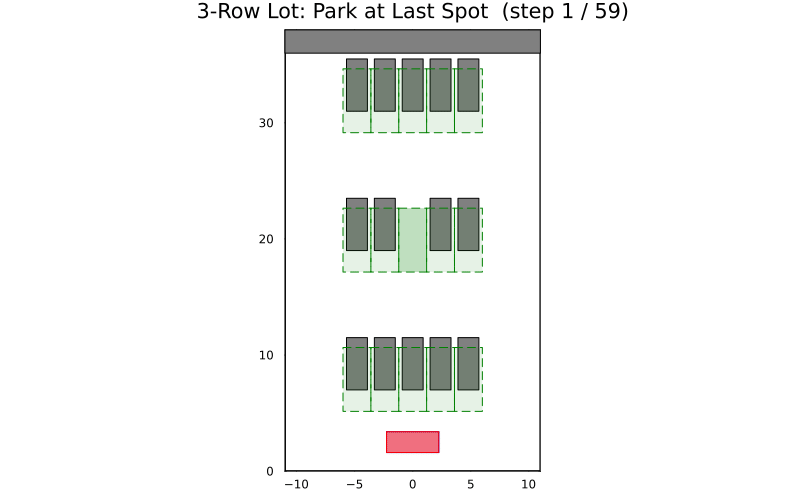

# Three-row parking lot

This example uses `three_rows_parking` to build a parking lot with several
rows of perpendicular spots (neighboring spots and a back wall included) and plans a
perpendicular park-in into the only free spot in the middle of a row. A 0.15 m
clearance is used for safety.

Full source:

```julia
# Three-row parking-lot example
# Plans into the middle free spot of a row with multiple neighbors.

using Parking
using Plots

# 1. Build the scenario (a row of perpendicular spots with neighbors)
env, vehicle = three_rows_parking()

# 2. Set the start pose on the lane
start = Pose(-8.0, 0.5, 0.0)

# 3. Plan
res = plan_park(vehicle, env, start; clearance = 0.15)
println("Status: ", res.status)

# 4. Draw and animate
plt = plot_scene(env, vehicle)
plt = plot_path!(plt, res.path; vehicle = vehicle)
display(plt)
animate_parking(env, vehicle, res.path; fps = 10,
                filename = "three_rows_parking.gif")
```

The generated animation of the planned maneuver:


