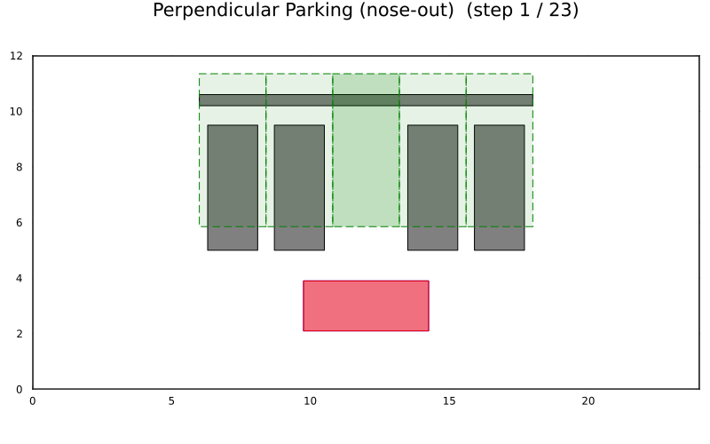

# 垂直泊车（车头朝外 / 倒车入库）

与 [车头驶入示例](perpendicular_parking.md) 类似，但目标最终航向为 `θ = -π/2`，
即车辆倒车入库、车头朝外指向车道。示例使用同样的受限车位（邻车 + 后墙），
并用 [`plan_leave`](@ref) 规划路径。

完整源码：

```julia
# 垂直泊车（车头朝外 / 倒车入库）示例
# 规划一条倒车入库、车头朝外的路径。

using Parking
using Plots

# 1. 构建场景（目标车位即为起始位置）
env, vehicle = perpendicular_nose_out()

# 2. 起始位形位于车位内，与车位航向（+y）对齐
start = env.spot.center

# 3. 规划驶离 / 倒车入库路径
res = plan_leave(vehicle, env, start; clearance = 0.15)
println("状态：", res.status)

# 4. 绘制与动画
plt = plot_scene(env, vehicle)
plt = plot_path!(plt, res.path; vehicle = vehicle)
display(plt)
animate_parking(env, vehicle, res.path; fps = 10,
                filename = "perpendicular_nose_out.gif")
```

规划动作的预生成动画如下：


