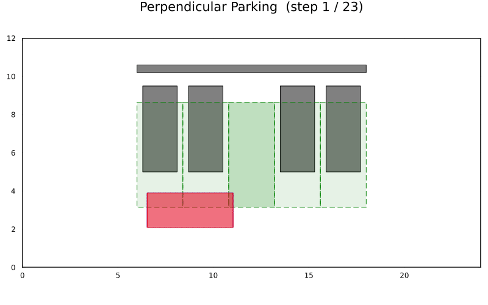

# 垂直泊车（车头驶入）

将车辆以 90 度垂直泊入一个两侧均有停放车辆、后方有墙的车位。示例通过
`perpendicular_parking` 构建一排等尺寸车位（目标位于中间），在车道上定义起始位形，
并用 [`plan_park`](@ref) 规划路径。

完整源码：

```julia
# 垂直泊车（车头驶入）示例
# 规划一条 90 度垂直泊入路径，目标车位两侧有车、后方有墙。

using Parking
using Plots

# 1. 构建场景（车头驶入）
env, vehicle = perpendicular_parking(; nose_in = true)

# 2. 设置车道上的起始位形
start = Pose(-6.0, 0.5, 0.0)

# 3. 规划
res = plan_park(vehicle, env, start; clearance = 0.15)
println("状态：", res.status)

# 4. 绘制与动画
plt = plot_scene(env, vehicle)
plt = plot_path!(plt, res.path; vehicle = vehicle)
display(plt)
animate_parking(env, vehicle, res.path; fps = 10,
                filename = "perpendicular_parking.gif")
```

规划动作的预生成动画如下：


